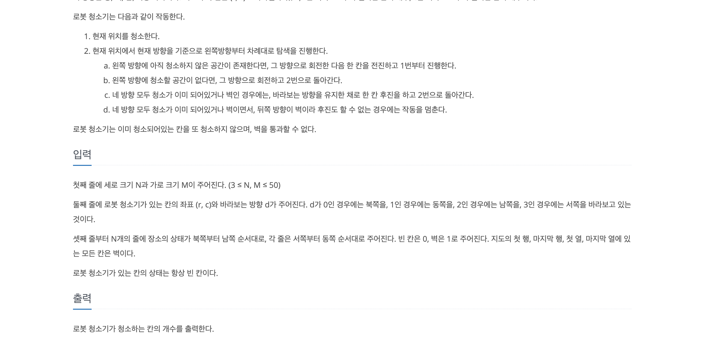

# 14503_로봇 청소기       
> 문제를 잘.... 읽어야겠다.      
   
     
    
   
로봇 청소기, BFS/DFS 와 같은 거리탐색과 사방탐색을 함께 활용한 문제이다.         
로봇 청소기는 자신이 청소했던 곳을 가지 못하며,         
현재 지역에 도착한다면(청소하든,후진하든) 반시계 방향으로 회전하면서 청소할 곳을 찾는다.       
만약 청소할 곳이 있다면 해당 위치로 이동해서 청소를 진행하고 다시 반시계 방향을 돌고         
만약 청소할 곳이 없다면 뒤로 후진한다. -> 이때 이전에 청소했던 곳과는 상관없다. 단, 벽만 없으면 된다.        
로봇청소기가 4방향 모두 회전도 했고, 바로 한칸 뒤에 벽이 있다면 종료시킨다.     
    
여기서 중요한 점은 **후진이다.**      
후진은 이름 그대로 후진이기에 기존 방향을 바꾸지 않고 뒤로 가야한다.     
이 점을 잘 활용해야하고      
      
**나의 반성점으로는**       
1. 문제를 꼼꼼히 읽는다, 후진과 같은 내용에 대해서 잘 안 읽은 것 같다.      
2. 기존 정형화된 방식을 사용하지 마라      
문제를 풀면서 다른 문제들과 비슷하게 bfs에 들어오면 바로 카운팅 시켰는데 사실 그러면 안된다.      
후진을 하면, 숫자가 증가 되지 않아야하며 청소를 했을 때만 카운트를 증가시켜줘야하기 때문이다.       
그렇기에 너무 기존에 사용했던 템플릿보다는 하나하나 꼼꼼히 코드를 작성하도록 하자    

  
```java
import java.io.BufferedReader;
import java.io.IOException;
import java.io.InputStreamReader;
import java.util.LinkedList;
import java.util.Queue;
import java.util.StringTokenizer;


// N x M
// 동서 남북 이동 가능
// 현재위치 청소 -> 청소 했으면 다시 안감
// 왼쪽방향에 청소 공간 존재하면 거기로 이동
// 청소 공간없다면 계속 돈다.
// 4방향 모두 청소, 벽이면 보는 방향 기준으로 뒤로가기
// 뒤쪽도 못가면 후진

class Robot {
    int x;
    int y;
    int dir;

    public Robot(int x, int y, int dir){
        this.x = x;
        this.y = y;
        this.dir = dir;
    }
}

class Main {
    private static final BufferedReader BUFFERED_READER = new BufferedReader(new InputStreamReader(System.in));
    private static final StringBuilder STRING_BUILDER = new StringBuilder();
    private static StringTokenizer stringTokenizer;

    private static int[] dx = {-1,0,1,0};
    private static int[] dy = {0,1,0,-1};
    private static int[] dirs = {3,0,1,2};
    private static int[] backDirs = {2,3,0,1};

    private static int dir;
    private static int n;
    private static int m;

    private static int start_x;
    private static int start_y;

    private static boolean isVisited[][];
    private static int map[][];
    private static final Queue<Robot> Q = new LinkedList<>();

    public static void main(String[] args) throws IOException {
        stringTokenizer = new StringTokenizer(BUFFERED_READER.readLine(), " ");
        n = Integer.parseInt(stringTokenizer.nextToken());
        m = Integer.parseInt(stringTokenizer.nextToken());
        map = new int[n][m];
        isVisited = new boolean[n][m];
        stringTokenizer = new StringTokenizer(BUFFERED_READER.readLine(), " ");
        start_x = Integer.parseInt(stringTokenizer.nextToken());
        start_y = Integer.parseInt(stringTokenizer.nextToken());
        dir = Integer.parseInt(stringTokenizer.nextToken());

        for(int i=0; i < n; i++){
            stringTokenizer = new StringTokenizer(BUFFERED_READER.readLine(), " ");
            for(int j=0; j < m; j++){
                if(stringTokenizer.nextToken().equals("0"))continue;
                map[i][j] = 1;
            }
        }

        Q.offer(new Robot(start_x, start_y, dir));
        isVisited[start_x][start_y] = true;
        int answer = 1;
        while (!Q.isEmpty()){
            int now_x = Q.peek().x;
            int now_y = Q.peek().y;
            int now_dir = Q.peek().dir;
            Q.poll();
            int origin_dir = now_dir;
            boolean flag = true;
            for(int i=0; i < 4; i++){
                now_dir = dirs[now_dir];
                int nx = now_x + dx[now_dir];
                int ny = now_y + dy[now_dir];
                if(nx < 0 || nx >= n || ny < 0 || ny >= m) continue;
                if(map[nx][ny] == 0 && isVisited[nx][ny] == false) {
                    answer++;
                    isVisited[nx][ny] = true;
                    Q.offer(new Robot(nx, ny, now_dir));
                    flag = false;
                    break;
                }
            }
            if(flag){
                int next_dir = backDirs[origin_dir];
                int nx = now_x + dx[next_dir];
                int ny = now_y + dy[next_dir];
                if(nx < 0 || nx >= n || ny < 0 || ny >= m) continue;
                if(map[nx][ny] == 0) {
                    Q.offer(new Robot(nx, ny, origin_dir));
                }
            }

        }
        System.out.println(answer);
    }


}
```
