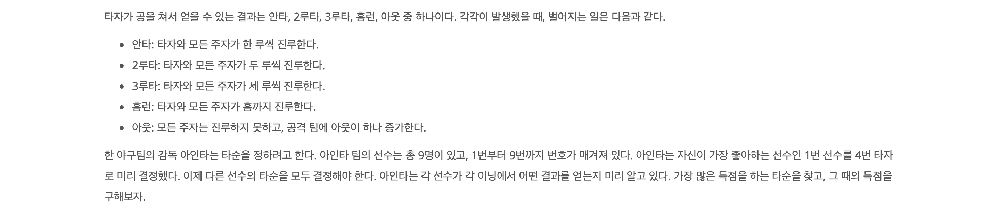
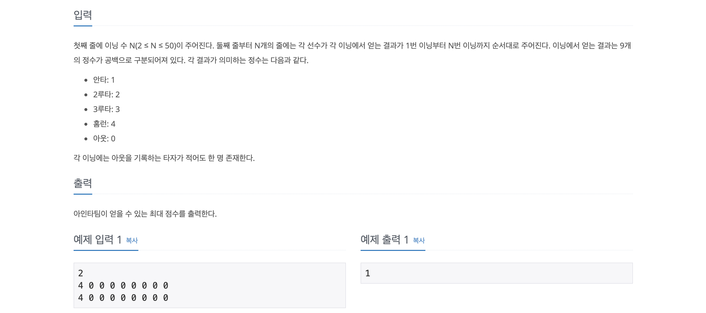

# 17281_⚾   


    
      
구현/시뮬레잇션 문제로 실제 야구와 동일한 로직을 작성하면된다.        
각 이닝마다 타석에 타자가 아웃,1루,2루,3루, 홈런을 칠 수 있으며       
3아웃이 되면 기존 이닝을 종료하고 다음 이닝으로 넘어간다.            
       
물론, 실제 야구처럼 안타를 칠 경우 베이스에는 주자가 존재하며      
주자가 홈으로 돌아왔을 때에는 팀의 점수가 올라간다.      
       
하지만, 제약 조건이 하나 더 있는데      
1번 선수를 4번 타자로 만든 후, 나머지 선수들에 대한 타석을 정해주어 가장 큰 값을 얻어내야 한다.         
   
이 문제를 풀기위해 브루트포스-순열을 이용했고, 간단히 하기 위해 c++의 `next_permutation`을 사용했다.     
순열을 이용해서 1번타자가 4번타자인 경우에만 이닝을 수행하는 코드를 작성했다.   
      
기존에는 계속 시간초과가 나왔는데,         
당황스럽게도 변수를 재귀에 넣는것이 아닌 전역변수로 사용하니 해결되었다.      
아마 재귀 스택을 만드는데 시간이 더 걸리는 것과 연산이 들어가는게 시간을 잡아먹은 것 같다.   

```c++
#include <iostream>
#include <algorithm>
#include <queue>

using namespace std;

// 1번 선수는 무조건 4번 타자

// 1.  2.    3.   4.     0
// 안타 2루타. 3루타. 4루타.  아웃.

// 선수 리스트에 대한 큐
// 순열 사용해서 1이 4번째일때만 동작하게끔 해야겠다.

// 이닝마다 루에 대한 큐 생성해줘야함
// 공 / 수 표시 없어도 됨
// 전체 스코어 표시해야함

int n;
vector<vector<int>> score;
vector<int> person;
int playGame(queue<int> &q, int inning, int point){
    if(inning == n) return point;
    int outCount = 0;
    queue<int> base;
    while (true) {
        if(outCount == 3) break;
        int player = q.front();
        int action = score[inning][player];
        q.push(player);
        q.pop();
        if(action == 0) {outCount++;}
        if(action == 1) {
            base.push(player);
            if(base.size() > 3){
                while (base.size()!=3) {
                    if(base.front() == -1) {base.pop(); continue;}
                    point++;
                    base.pop();
                }
            }
        }
        if (action == 2){
            base.push(player);
            base.push(-1);
            if(base.size() > 3){
                while (base.size()!=3) {
                    if(base.front() == -1) {base.pop(); continue;}
                    point++;
                    base.pop();
                }
            }
        }
        if (action == 3){
            base.push(player);
            base.push(-1);
            base.push(-1);
            if(base.size() > 3){
                while (base.size()!=3) {
                    if(base.front() == -1) {base.pop(); continue;}
                    point++;
                    base.pop();
                }
            }
        }
        if (action == 4){
            point++;
            while (!base.empty()) {
                if(base.front() == -1) {base.pop(); continue;}
                point++;
                base.pop();
            }
        }
    }
    return playGame(q,  inning+1, point);
}

int main() {
    int answer = 0; // 후에 max로 값 채움
    cin >> n; // 이닝 수
    person = {0,1,2,3,4,5,6,7,8}; // 순열 돌릴 예정.
    score.resize(n, vector<int>(9, 0));
    
    for(int i = 0; i < score.size(); i++){
        for(int j=0; j < 9; j++){
            cin >> score[i][j];
        }
    }

    do {
        if(person[3] != 0) continue;
        queue<int> q;
        for(int i=0; i < person.size(); i++){ q.push(person[i]);}
        answer = max(answer, playGame(q, 0, 0));
    } while (next_permutation(person.begin(), person.end()));
    
    cout << answer << "\n";
    
    return 0;
}

```
